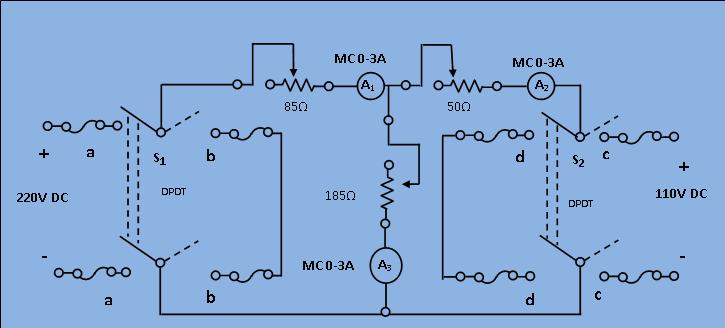

### Procedure

								<h2>Circuit Diagram:</h2>
								

								
[Fig 1: Circuit diagram of experimental set-up for verification of Superposition theorem]
 
								 
								

								<ol type="1">
									<li>Connect the circuit as shown in the diagram, keeping the switches open and resistance at their maximum positions. </li>
									<li>Set S1 to position "aa" and S2 to position "cc" respectively which means both the sources are energized. Note down the 
									current I1, I2 and I3 from ammeter A1, A2 and A3.</li> 
									<li>Set S1 to positions "aa" and S2 to position "dd" respectively which means the, only 220V source is energized and the 
									terminals of S2 are shorted. Note down current I1', I2' and I3'from the ammeter A1, A2 and A3. </li>
									<li>Set S1 to position "bb" and S2 to position to "cc" respectively. Which means the, only 110V source is energized and the 
									terminals of S1 are shorted. Note down current I1'', I2'' and I3'' from the ammeter A1, A2 and A3.  </li>
									<li>Compare I1, I2 and I3 with I1'+I1'', I2'+I2'' and I3'+I3'' taking care of signs properly of verify the theorem.  
                                    </li>
									<li>Repeat the step (2) to (6) for five different values of resistance for each three rheostats. </li>
								</ol>    
								

							
 