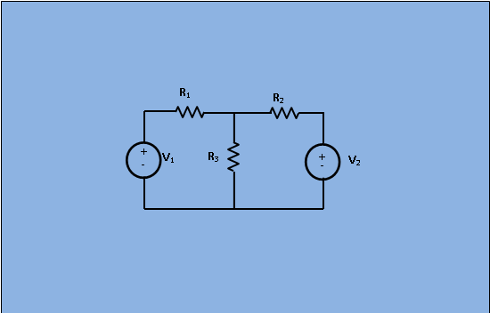
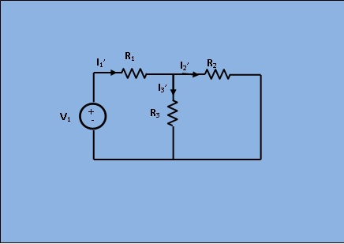
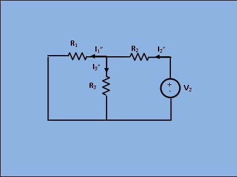

### Theory

If a number of voltage or current source are acting simultaneously in a linear network, the resultant current in any branch is the algebraic sum of the currents that would be produced in it, when each source acts alone replacing all other independent sources by their internal resistances.
 
<h2>Circuit Diagram:</h2>

 

 &nbsp&nbsp&nbsp&nbsp&nbsp&nbsp&nbsp&nbsp
[Fig 1: Circuit for analysis of Superposition theorem]
 &nbsp&nbsp&nbsp&nbsp&nbsp&nbsp&nbsp&nbsp&nbsp&nbsp&nbsp&nbsp&nbsp&nbsp&nbsp
 [Fig 2: Circuit with only V2 short circuited]
 
In given figure 1 apply superposition theorem , let us first take the sources V1 alone at first replacing V2 by short circuit as shown in figure 2.Here,
$$[ I_{1'} = \frac{V_1}{\frac{R_2*R_3}{R_2+R_3}+R_1}]$$
$$[I_{2'} = I_{1'}* \frac{R_3}{R_2+R_3}]$$
$$[I_{3'} = I_{1'} - I_{2'}]$$								

 [Fig 3: Circuit with only V1 short circuited]
 
 
Next, removing V1 by short circuit, let the circuit be energized by V2 only as shown in figure 3. Then,
$$[ I_{2''} = \frac{V_2}{\frac{R_2*R_3}{R_2+R_3}+R_2}]$$
$$[I_{1''} = I_{2''}* \frac{R_3}{R_1+R_3}]$$
$$[I_{3''} = I_{2''} - I_{1''}]$$
As per superposition theorem,
$$[I_{3} = I_{3'} + I_{3''}]$$
$$[I_{2} = I_{2'} - I_{2''}]$$
$$[I_{1} = I_{1'} - I_{1''}]$$

    

                           